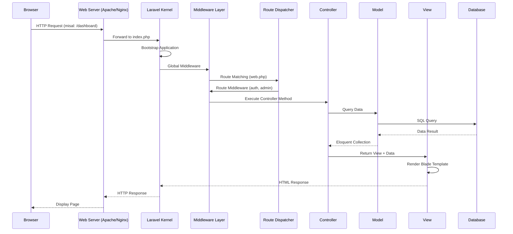
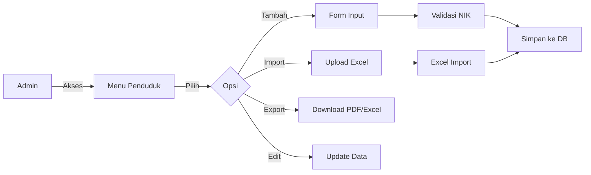
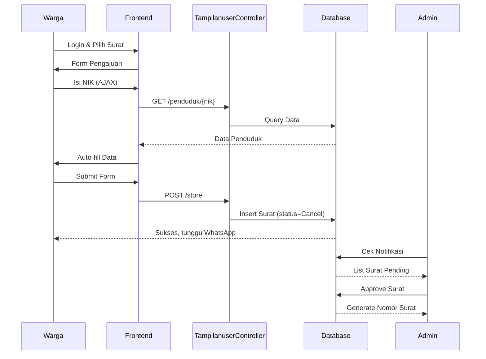

# Dokumentasi KPSIDESA - Sistem Informasi Desa

> Dokumentasi fundamental aplikasi KPSIDESA untuk developer. Dokumen ini menjelaskan cara kerja aplikasi secara menyeluruh agar developer baru dapat memahami sistem dengan cepat.

---

## 1. Overview Aplikasi

### 1.1 Tujuan dan Fungsi Utama

**KPSIDESA** adalah aplikasi website administrasi desa yang dirancang untuk:

- **Publikasi Informasi Desa**: Menyajikan berita, agenda, galeri, potensi desa, dan informasi aparatur kepada masyarakat umum.
- **Pengelolaan Data Internal**: Mengelola data penduduk, surat-menyurat, produk desa, dan user.
- **Layanan Surat Online**: Memfasilitasi pengajuan surat (SKTM, SKU, Surat Domisili) oleh warga secara online.
- **E-Learning**: Menyediakan modul pembelajaran untuk masyarakat desa.

### 1.2 Teknologi Stack

| Komponen | Teknologi |
|----------|-----------|
| **Backend Framework** | Laravel 11 (PHP 8.2+) |
| **Frontend Build** | Vite, Bootstrap, Vue.js (sebagian komponen) |
| **Database** | MySQL/MariaDB |
| **Template Admin** | AdminLTE 3 |
| **Template Frontend** | Constra |
| **PDF Generation** | barryvdh/laravel-dompdf |
| **Excel Import/Export** | maatwebsite/excel |
| **Authentication** | Laravel UI (Bootstrap Auth) |

### 1.3 Arsitektur Umum Aplikasi

```
┌─────────────────────────────────────────────────────────────────┐
│                        USER LAYER                               │
│  ┌──────────────┐  ┌──────────────┐  ┌──────────────────────┐  │
│  │  Masyarakat  │  │     Admin    │  │    Karang Taruna     │  │
│  │  (Frontend)  │  │   (Backend)  │  │      (Backend)       │  │
│  └──────────────┘  └──────────────┘  └──────────────────────┘  │
└─────────────────────────────────────────────────────────────────┘
                              │
                              ▼
┌─────────────────────────────────────────────────────────────────┐
│                     LARAVEL APPLICATION                         │
│  ┌──────────┐  ┌──────────┐  ┌──────────┐  ┌──────────────┐    │
│  │  Routes  │──▶│Middleware│──▶│Controllers│──▶│    Views     │    │
│  │ (web.php)│  │ (Admin,  │  │ (CRUD)   │  │  (Blade)     │    │
│  │          │  │checkuser)│  │          │  │              │    │
│  └──────────┘  └──────────┘  └──────────┘  └──────────────┘    │
│       │                                         ▲              │
│       ▼                                         │              │
│  ┌──────────┐                              ┌──────────┐       │
│  │  Models  │──────────────────────────────▶│ Eloquent │       │
│  │(Database)│                              │  (ORM)   │       │
│  └──────────┘                              └──────────┘       │
└─────────────────────────────────────────────────────────────────┘
                              │
                              ▼
┌─────────────────────────────────────────────────────────────────┐
│                      DATA LAYER                                 │
│              MySQL Database (db_sidesa)                         │
└─────────────────────────────────────────────────────────────────┘
```

---

## 2. Alur Kerja Fundamental

### 2.1 Request Lifecycle

Berikut adalah alur kerja request dari browser hingga response:



### 2.2 Bagaimana Routing Bekerja

Semua route didefinisikan di file `routes/web.php`. Ada 3 kategori utama:

#### A. Route Publik (Tanpa Login)
```php
// Homepage - Controller utama untuk frontend
Route::get('/', [TampilanuserController::class, 'index'])->name('indexuser');

// Halaman statis
Route::get('/kontak', function () { return view('frontend/kontak'); });
Route::get('/visimisi', function () { return view('frontend/visimisi'); });

// E-Learning
Route::get('/e-learning', [ELearningController::class, 'index']);

// Katalog Produk
Route::get('/produk', [ProductCatalogController::class, 'index']);
Route::get('/produk/{slug}', [ProductCatalogController::class, 'show']);
```

#### B. Route dengan Middleware Auth
```php
// Semua route dalam group ini memerlukan login
Route::group(['middleware' => ['auth', 'admin']], function () {
    Route::get('/dashboard', [DashboardController::class, 'index']);
    // ... route admin lainnya
});
```

#### C. Route dengan Prefix
```php
Route::group(['prefix' => 'penduduk'], function () {
    Route::get('index', [PendudukController::class, 'index'])->name('pendudukindex');
    Route::get('create', [PendudukController::class, 'create'])->name('pendudukcreate');
    Route::post('store', [PendudukController::class, 'store'])->name('pendudukstore');
    // ... dst
});
```

**Cara kerja**: Laravel mencocokkan URL dengan pattern route, mengekstrak parameter (jika ada), lalu menjalankan middleware dan controller yang terdaftar.

### 2.3 Middleware yang Digunakan

Middleware adalah "penjaga pintu" yang memeriksa request sebelum masuk ke controller.

| Middleware | Fungsi | Digunakan Di |
|------------|--------|--------------|
| `auth` | Memastikan user sudah login | Route admin & karangtaruna |
| `admin` | Hanya allow role "admin" | Route manajemen data penting |
| `checkuser` | Allow role: admin, karangtaruna, user | Route agenda karangtaruna |
| `karangtaruna` | Hanya allow role "karangtaruna" | (Reserved) |

**Contoh implementasi** (`app/Http/Middleware/Admin.php`):
```php
public function handle(Request $request, Closure $next): Response
{
    if (!Auth::check()) {
        return redirect('/login');  // Belum login? Redirect ke login
    }
    
    if (Auth::user()->level === 'admin') {
        return $next($request);  // Lanjutkan ke controller
    }
    
    abort(403, 'You do not have access.');  // Forbidden
}
```

### 2.4 Controller Pattern

Aplikasi menggunakan pattern **Resource Controller** untuk CRUD:

```
┌─────────────────────────────────────────────────────────────┐
│                    CRUD Pattern                             │
├─────────────────────────────────────────────────────────────┤
│ Method    │ Route           │ Fungsi                        │
├─────────────────────────────────────────────────────────────┤
│ index()   │ GET /resource   │ Menampilkan list data         │
│ create()  │ GET /create     │ Form tambah data baru         │
│ store()   │ POST /store     │ Simpan data baru              │
│ show()    │ GET /{id}       │ Detail data                   │
│ edit()    │ GET /{id}/edit  │ Form edit data                │
│ update()  │ PUT /{id}       │ Update data                   │
│ destroy() │ DELETE /{id}    │ Hapus data                    │
└─────────────────────────────────────────────────────────────┘
```

**Contoh konkret** - `PendudukController::store()`:
```php
public function store(PendudukRequest $request)
{
    $penduduk = new Penduduk;
    $penduduk->nik = $request->get('nik');
    $penduduk->no_kk = $request->get('no_kk');
    // ... mapping field lainnya
    $penduduk->save();
    
    return redirect()->route('pendudukindex');  // Redirect ke index
}
```

---

## 3. Struktur Database & Model

### 3.1 Skema Database Utama

```mermaid
erDiagram
    USERS ||--o{ BERITA : creates
    USERS ||--o{ SURAT : submits
    USERS ||--o{ AGENDA : creates
    USERS ||--o{ AGENDA_KARANGTARUNA : creates
    
    PENDUDUK ||--o{ SURAT : has
    PENDUDUK ||--o{ SURAT_DOMISILI : has
    PENDUDUK ||--o{ SURAT_USAHA : has
    
    KEPALA_DESA ||--o{ SURAT : signs
    KEPALA_DESA ||--o{ SURAT_DOMISILI : signs
    KEPALA_DESA ||--o{ SURAT_USAHA : signs
    
    PRODUCT ||--o{ PRODUCT_IMAGE : has
    PRODUCT ||--o{ PRODUCT_CATEGORY_PRODUCT : categorized
    PRODUCT_CATEGORY ||--o{ PRODUCT_CATEGORY_PRODUCT : contains
    
    USERS {
        bigint id PK
        string name
        string email
        string password
        string level "admin/karangtaruna/user"
    }
    
    PENDUDUK {
        string nik PK
        string no_kk
        string nama_lengkap
        string jenis_kelamin
        string hubungan
        date tanggal_lahir
        string status "kawin/blm kawin"
        string pendidikan
        string pekerjaan
        string dusun
        string rt
        string rw
    }
    
    BERITA {
        bigint id PK
        string judul
        string slug UK
        text content
        string gambar
        bigint user_id FK
        timestamps
    }
    
    SURAT {
        bigint id PK
        string nik FK
        string no_kk
        string nama
        enum pilihsurat
        string no_hp
        boolean is_read
        enum status "Approve/Cancel"
        bigint user_id FK
        timestamps
    }
    
    PRODUCT {
        bigint id PK
        string nama
        string slug UK
        text deskripsi
        decimal harga
        integer stok
        string status "draft/published/archived"
        boolean is_featured
        timestamps
    }
```

### 3.2 Relasi Antar Model

#### One-to-Many (Has Many / Belongs To)
```php
// User memiliki banyak Berita
class User extends Authenticatable {
    public function beritas() {
        return $this->hasMany(Berita::class);
    }
}

// Berita dimiliki oleh satu User
class Berita extends Model {
    public function user() {
        return $this->belongsTo(User::class);
    }
}
```

#### Many-to-Many (Belongs To Many)
```php
// Product memiliki banyak Category
class Product extends Model {
    public function categories() {
        return $this->belongsToMany(ProductCategory::class, 'product_category_product');
    }
}

// Category memiliki banyak Product
class ProductCategory extends Model {
    public function products() {
        return $this->belongsToMany(Product::class, 'product_category_product');
    }
}
```

### 3.3 Eloquent ORM - Cara Data Diakses

#### Query Dasar
```php
// Mengambil semua data
$penduduk = Penduduk::all();

// Mengambil dengan kondisi
$pendudukLaki = Penduduk::where('jenis_kelamin', 'LK')->get();
$pendudukRT01 = Penduduk::where('rt', '01')->count();

// Mengambil satu data
$berita = Berita::where('slug', $slug)->first();
$berita = Berita::find($id);  // by primary key

// Pagination
$berita = Berita::orderBy('created_at', 'desc')->paginate(10);
```

#### Query dengan Relasi
```php
// Eager loading (optimasi query)
$products = Product::with(['primaryImage', 'categories'])->get();

// Query berdasarkan relasi
$products = Product::whereHas('categories', function($query) {
    $query->where('slug', 'makanan');
})->get();
```

#### Menyimpan Data
```php
// Cara 1: Instance baru
$surat = new Surat();
$surat->nik = $request->get('nik');
$surat->nama = $request->get('nama');
$surat->save();

// Cara 2: Mass assignment (dengan $fillable/$guarded)
Penduduk::create($request->all());

// Cara 3: Update
$penduduk = Penduduk::find($id);
$penduduk->update($request->all());
```

---

## 4. Komponen Kunci Laravel

### 4.1 Service Providers

Service Provider adalah tempat mendaftarkan service ke dalam aplikasi.

**File**: `app/Providers/AppServiceProvider.php`

```php
class AppServiceProvider extends ServiceProvider
{
    // Register: Binding class ke container
    public function register(): void
    {
        // Contoh: $this->app->bind(Interface::class, Implementation::class);
    }

    // Boot: Dipanggil setelah semua provider diregister
    public function boot(): void
    {
        // Contoh: View::share('key', 'value');
    }
}
```

**Kenapa penting**: Semua konfigurasi awal aplikasi (bootstrapping) dilakukan di sini.

### 4.2 Dependency Injection & Service Container

Laravel menggunakan Service Container untuk mengelola dependencies.

**Contoh dalam Controller**:
```php
// Method Injection - Laravel otomatis inject Request
public function store(Request $request)
{
    // $request sudah tersedia tanpa new Request()
}

// Constructor Injection
class ProductController extends Controller
{
    protected $productService;
    
    public function __construct(ProductService $productService)
    {
        $this->productService = $productService;
    }
}
```

**Kenapa ini penting**: Memudahkan testing dan mengikuti prinsip Single Responsibility.

### 4.3 Blade Templating

Blade adalah template engine Laravel. File template disimpan di `resources/views/`.

#### Struktur Template
```
resources/views/
├── adminlte/
│   ├── master.blade.php      # Layout utama admin
│   └── partial/
│       ├── navbar.blade.php
│       └── sidebar.blade.php
├── frontend/
│   └── index.blade.php       # Homepage
└── berita/
    ├── index.blade.php       # List berita
    ├── create.blade.php      # Form tambah
    └── edit.blade.php        # Form edit
```

#### Sintaks Blade
```blade
{{-- Extends layout --}}
@extends('adminlte.master')

{{-- Section content --}}
@section('content')
    <h1>{{ $title }}</h1>  {{-- Output variabel --}}
    
    {{-- Looping --}}
    @foreach($berita as $item)
        <article>{{ $item->judul }}</article>
    @endforeach
    
    {{-- Conditional --}}
    @if($user->isAdmin())
        <a href="/admin">Admin Panel</a>
    @endif
@endsection

{{-- Include partial --}}
@include('adminlte.partial.navbar')
```

### 4.4 Authentication & Authorization

#### Sistem Auth
```php
// Laravel UI menyediakan auth scaffolding
Auth::routes(['register' => false]);  // Disable default register

// Custom register untuk user biasa
Route::get('/register/user', [UserRegisterController::class, 'showRegisterForm']);
Route::post('/register/user', [UserRegisterController::class, 'register']);
```

#### Role-based Access
Role disimpan di kolom `users.level` dengan nilai:
- `admin` - Akses penuh ke semua fitur
- `karangtaruna` - Akses agenda dan berita
- `user` - Hanya akses frontend dan pengajuan surat

```php
// Check role dalam controller
if (Auth::user()->level === 'admin') {
    // Logic admin
}

// Check dengan method model
if ($user->isAdmin()) { ... }
if ($user->isKarangTaruna()) { ... }
```

### 4.5 Queue & Jobs

Saat ini aplikasi **belum menggunakan Queue** secara ekstensif. Namun, konfigurasi queue sudah tersedia:

```php
// config/queue.php
QUEUE_CONNECTION=database  // Bisa juga: redis, sqs
```

Untuk fitur notifikasi email di masa depan, queue dapat diimplementasikan.

---

## 5. Fitur Utama Aplikasi

### 5.1 Manajemen Data Penduduk

**Alur Proses**:


**File Penting**:
- Controller: `app/Http/Controllers/PendudukController.php`
- Model: `app/Models/Penduduk.php`
- Views: `resources/views/penduduk/`
- Import: `app/Imports/PendudukImport.php`
- Export: `app/Exports/ExportPenduduk.php`

**Fitur Spesial**:
- AJAX lookup: `GET /penduduk/{nik}` - Mengambil data penduduk via AJAX untuk auto-fill form surat

### 5.2 Pengelolaan Surat

Ada 3 jenis surat yang dikelola:

| Jenis Surat | Model | Tabel | Fitur |
|-------------|-------|-------|-------|
| SKTM (Tidak Mampu) | `Surat` | `surat` | Pengajuan, Approval, Cetak PDF |
| SKU (Usaha) | `Surat_KeteranganUsaha` | `surat_keterangan_usaha` | + Field bidang_usaha |
| Domisili | `Surat_KeteranganDomisili` | `surat_domisili` | + Field lengkap alamat |

**Alur Pengajuan Surat**:


**File Penting**:
- Controller: `app/Http/Controllers/TampilanuserController.php` (frontend)
- Controller: `app/Http/Controllers/SuratController.php` (admin)
- Model: `app/Models/Surat.php`
- View Cetak: `resources/views/surat/cetak.blade.php`

### 5.3 Katalog Produk Desa

**Fitur**:
- List produk dengan filter kategori
- Detail produk dengan galeri gambar
- WhatsApp integration untuk pemesanan

**Relasi Database**:
```
products (1) ---- (*) product_images
products (*) ---- (*) product_categories (via product_category_product)
```

**Fitur Spesial - WhatsApp Integration**:
```php
// app/Models/Product.php
public function whatsappUrl(): string
{
    $phone = config('services.whatsapp.number');
    $message = "Halo, Saya tertarik dengan {$this->nama}...";
    return 'https://wa.me/'.$phone.'?text='.rawurlencode($message);
}
```

### 5.4 E-Learning

Modul e-learning menyediakan konten pembelajaran statis:
- Hidup Sehat
- Pengolahan Sampah
- Manajemen Keuangan

**File**: `app/Http/Controllers/ELearningController.php`

### 5.5 Infografis Penduduk

Menghitung dan menampilkan statistik penduduk:
- Per RT (01-07)
- Per Jenis Kelamin
- Per Pendidikan
- Per Pekerjaan
- Per Status Perkawinan

**Implementasi** (`TampilanuserController::infografis()`):
```php
$rt01 = Penduduk::where('rt', '01')->count();
$rt01LK = Penduduk::where('rt', '01')->where('jenis_kelamin', 'LK')->count();
// ... dst
```

---

## 6. Konfigurasi Penting

### 6.1 Environment Variables (.env)

```bash
# Application
APP_NAME=KPSIDESA
APP_ENV=local
APP_KEY=base64:xxx
APP_DEBUG=true
APP_URL=http://localhost

# Database
DB_CONNECTION=mysql
DB_HOST=127.0.0.1
DB_PORT=3306
DB_DATABASE=db_sidesa
DB_USERNAME=root
DB_PASSWORD=

# Queue (untuk fitur async)
QUEUE_CONNECTION=database

# Mail (untuk notifikasi)
MAIL_MAILER=smtp
MAIL_HOST=smtp.gmail.com
MAIL_PORT=587
MAIL_USERNAME=your-email@gmail.com
MAIL_PASSWORD=your-app-password

# WhatsApp (untuk fitur produk)
WHATSAPP_NUMBER=6287735495286
```

### 6.2 Config Files Penting

| File | Fungsi |
|------|--------|
| `config/app.php` | Nama aplikasi, timezone, locale |
| `config/auth.php` | Konfigurasi authentication |
| `config/database.php` | Koneksi database |
| `config/filesystems.php` | Storage disk (local/public) |
| `config/services.php` | Third-party services (WhatsApp) |

### 6.3 Third-party Integrations

#### Laravel Excel (maatwebsite/excel)
Digunakan untuk import/export data penduduk.

```php
// Export
return Excel::download(new ExportPenduduk, 'penduduk.xlsx');

// Import
Excel::import(new PendudukImport, $file);
```

#### Laravel DOMPDF (barryvdh/laravel-dompdf)
Digunakan untuk cetak surat dan laporan.

```php
$pdf = Pdf::loadview('surat.cetak', compact('surat'));
return $pdf->stream('surat.pdf');
```

---

## 7. Cheat Sheet untuk Developer Baru

### 7.1 Menambahkan Fitur Baru

```
1. Buat Migration
   php artisan make:migration create_nama_tabel

2. Buat Model
   php artisan make:model NamaModel

3. Buat Controller
   php artisan make:controller NamaController --resource

4. Definisikan Route di routes/web.php

5. Buat Views di resources/views/namafolder/

6. Update Sidebar di resources/views/adminlte/partial/sidebar.blade.php
```

### 7.2 Command Artisan yang Sering Digunakan

```bash
# Server development
php artisan serve

# Route list
php artisan route:list

# Clear cache
php artisan cache:clear
php artisan config:clear
php artisan view:clear

# Database
php artisan migrate
php artisan migrate:rollback
php artisan db:seed

# Storage link (untuk akses file upload)
php artisan storage:link
```

### 7.3 Debugging Tips

```php
// Dump and Die
 dd($variable);

// Log ke file storage/logs/laravel.log
 Log::info('Debug message', ['data' => $variable]);

// Query Log (di controller)
 DB::enableQueryLog();
 // ... query
 dd(DB::getQueryLog());
```

---

## 8. Arsitektur Folder yang Perlu Dipahami

```
kpsidesa/
├── app/
│   ├── Http/
│   │   ├── Controllers/     # Logika bisnis
│   │   │   └── Auth/        # Controller autentikasi
│   │   ├── Middleware/      # Filter request
│   │   └── Requests/        # Validasi form
│   ├── Models/              # Eloquent Models
│   ├── Imports/             # Excel imports
│   ├── Exports/             # Excel exports
│   └── Mail/                # Email templates
├── config/                  # Konfigurasi aplikasi
├── database/
│   └── migrations/          # Skema database
├── resources/
│   └── views/               # Blade templates
│       ├── adminlte/        # Layout admin
│       ├── frontend/        # Halaman publik
│       └── */               # Folder per modul
├── routes/
│   └── web.php              # Semua route aplikasi
├── storage/
│   └── app/public/          # File upload (gambar, dokumen)
└── public/
    └── storage/             # Symlink ke storage/app/public
```

---

## 9. Hal yang Perlu Diperhatikan

1. **Primary Key Penduduk**: Menggunakan NIK (string), bukan auto-increment.
2. **Surat Model Terpisah**: Ada 3 tabel untuk 3 jenis surat.
3. **Notifikasi**: Menggunakan kolom `is_read` pada tabel surat, bukan tabel notifikasi terpisah.
4. **Kepala Desa**: Disimpan di tabel terpisah (`kepala_desa`) untuk data tanda tangan.
5. **Soft Delete**: Tidak digunakan saat ini. Data yang dihapus benar-benar terhapus.

---

**Dokumentasi ini ditulis untuk membantu developer baru memahami KPSIDESA. Jika ada yang perlu ditanyakan, silakan merujuk ke file-file yang disebutkan di atas.**

*Last Updated: Februari 2026*
